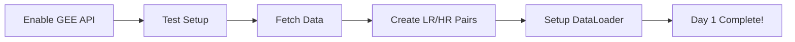

# 🔧 Day 1 Setup - Final Steps

## ✅ What's Done
- [x] Project structure created
- [x] All dependencies installed
- [x] Configuration file ready with streaming data sources
- [x] Dataset classes integrate with WorldStrat official loader

## ⚠️ Action Required: Enable Google Earth Engine

### Step 1: Register Project with Earth Engine
1. Visit: https://console.cloud.google.com/earth-engine/configuration?project=projectklymo
2. Click **"Register Project"** or **"Enable API"**
3. Choose **"Noncommercial"** use case
4. Wait 2-3 minutes for activation

### Step 2: Authenticate Earth Engine
```bash
earthengine authenticate
```
This opens a browser for one-time authentication.

### Step 3: Verify Setup
```bash
python test_gee_streaming.py
```
All 5 tests should pass!

### Step 3: Verify Setup
After enabling the API, run:
```bash
.\venv\Scripts\Activate.ps1
python test_setup.py
```

All tests should pass!

---

## 🚀 Once Tests Pass

### Option A: Interactive Notebook (Recommended for Learning)
```bash
.\venv\Scripts\Activate.ps1
jupyter notebook notebooks/01_day1_data_ingestion.ipynb
```

### Option B: Quick Test (Fetch Single Patch)
```bash
.\venv\Scripts\Activate.ps1
python -c "from src.data.gee_fetcher import GEEFetcher; fetcher = GEEFetcher(); patch = fetcher.fetch_specific_location('Delhi', save_path='delhi_test.png'); print('✅ Success!' if patch is not None else '❌ Failed')"
```

### Option C: Fetch Small Dataset (50 samples, ~15 mins)
```bash
.\venv\Scripts\Activate.ps1
python -c "from src.data.gee_fetcher import GEEFetcher; fetcher = GEEFetcher(); fetcher.fetch_dataset(num_samples=50, save_dir='./data/raw_test', region='india')"
```

---

## 📊 Day 1 Workflow



### Estimated Times
- **Setup & Testing**: 10 minutes ✅ (done)
- **Enable API**: 5 minutes ⏳ (waiting)
- **Fetch 50 samples**: 15 minutes
- **Process dataset**: 5 minutes
- **Test DataLoader**: 2 minutes
- **Total**: ~40 minutes

---

## 🎯 After Day 1

### Push to GitHub (Tonight)
```bash
git init
git add .
git commit -m "Day 1: Data ingestion pipeline complete"
git branch -M main
git remote add origin https://github.com/yourusername/projectklymo.git
git push -u origin main
```

### Day 2: Training in Colab (Tomorrow)
1. Open Google Colab
2. Clone your repo: `!git clone https://github.com/yourusername/projectklymo.git`
3. Fetch larger dataset (1000 samples)
4. Implement SwinIR model
5. Train for 100-150 epochs

---

## 🆘 Troubleshooting

### "API not enabled" error
- Wait 2-3 minutes after enabling
- Refresh the page
- Try `earthengine authenticate` again

### "Out of memory" error
- Reduce `num_samples`
- Reduce `patch_size` in config.yaml

### Import errors
```bash
.\venv\Scripts\Activate.ps1
pip install -r requirements.txt --upgrade
```

---

## 📞 Need Help?

Check the README.md for detailed documentation and usage examples.

Current Status: **Day 1 - 95% Complete** (Just enable the API!)
